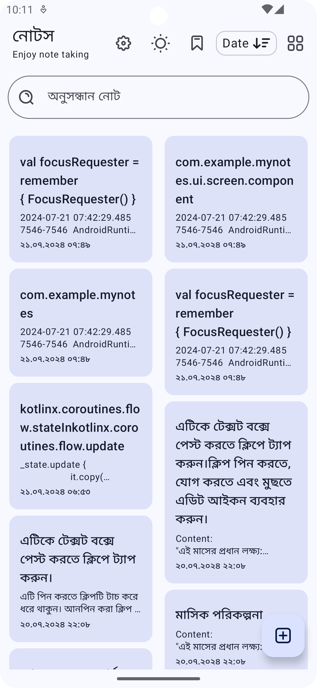
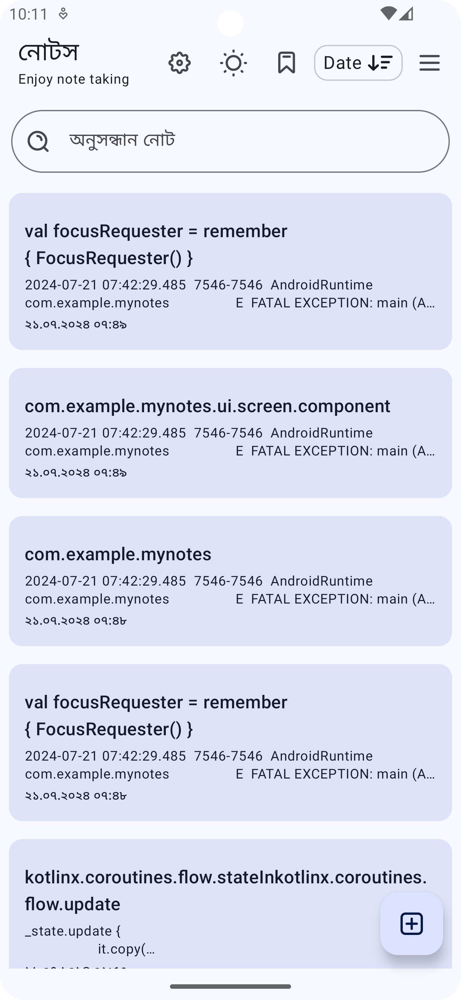

# Note App

This project is a simple yet powerful Note app designed to help you learn and practice Room Database state management and CRUD (Create, Read, Update, Delete) operations. The app features a clean UI design, ensuring that the keyboard does not overlap with text input fields. It includes several advanced functionalities, making it a comprehensive learning tool for Android development.

## Features

- **Add Note**: Easily create new notes with a simple and intuitive interface.
- **Delete Note**: Remove unwanted notes effortlessly.
- **Bookmark Note**: Mark important notes for quick access.
- **Toggle Card View and List View**: Switch between card and list views to organize your notes the way you prefer.
- **Toggle Date and Title Filter**: Filter notes by date or title for easy navigation.
- **Search Notes**: Search notes by title title or content 
- **Theme Switcher**: Switch to dark mode and light mode 
- **Language Select**: Select language feature 

## Tech Stack

- **Jetpack Compose**: For building a modern, responsive UI.
- **Dagger Hilt**: For dependency injection, ensuring clean and maintainable code.
- **Room Database**: For efficient and robust data storage and retrieval.

## Screenshots

    
    
    
    
    
    
    

This app not only helps in learning the intricacies of Room Database but also provides a hands-on experience with Jetpack Compose and Dagger Hilt, making it an excellent choice for anyone looking to deepen their understanding of modern Android development practices.
